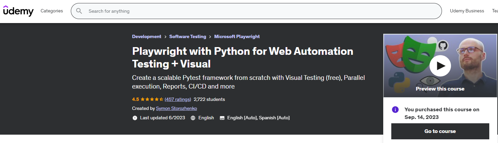

# Udemy course exercises with Python + Playwright

This repository contains python code from Udemy
course [Playwright with Python for Web Automation Testing + Visual](https://www.udemy.com/course/playwright-with-python-for-web-automation-testing/).

In this course we will cover:

- Python basics
- Playwright
- pytest
- project structure
- page object model
- reporting
- parallel execution
- create our own pytest fixtures for set_up and tear_down methods
- utilize existing Playwright fixtures
- deploy our test to CI/CD using GitHub Actions
- learn yml syntax
- store login passwords securely as GitHub Secrets
- perform Visual Testing like a pro